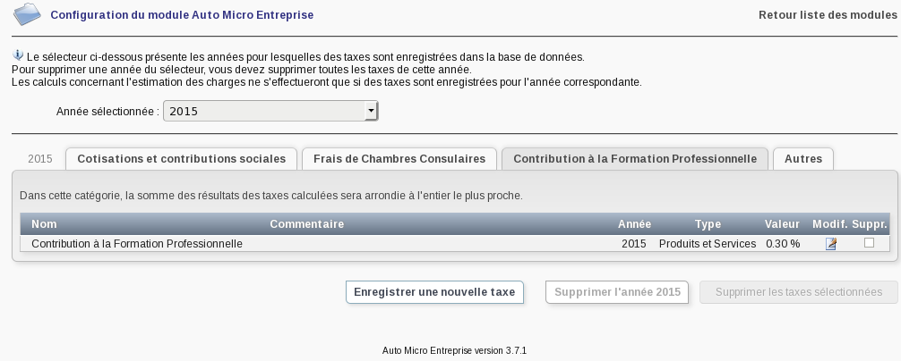

# AutoMicroEntreprise Module FOR <a href="https://www.dolibarr.org">DOLIBARR ERP CRM</a>

This module is currently unmaintained.

Last tested dolibarr version : 10.0.x

You can open bugs if you want, but they will probably be ignored.

## Features

{imgmd}
{imgmd}
{imgmd}
{imgmd}
{imgmd}

Other modules are available on <a href="https://www.dolistore.com" target="_new">Dolistore.com</a>.


## Install
----------

### From the ZIP file and GUI interface

- If you get the module in a zip file (like when downloading it from the market place [Dolistore](https://www.dolistore.com)), go into
menu ```Home - Setup - Modules - Deploy external module``` and upload the zip file.


Note: If this screen tell you there is no custom directory, check your setup is correct: 

- In your Dolibarr installation directory, edit the ```htdocs/conf/conf.php``` file and check that following lines are not commented:

    ```php
    //$dolibarr_main_url_root_alt ...
    //$dolibarr_main_document_root_alt ...
    ```

- Uncomment them if necessary (delete the leading ```//```) and assign a sensible value according to your Dolibarr installation

    For example :

    - UNIX:
        ```php
        $dolibarr_main_url_root_alt = '/custom';
        $dolibarr_main_document_root_alt = '/var/www/Dolibarr/htdocs/custom';
        ```

    - Windows:
        ```php
        $dolibarr_main_url_root_alt = '/custom';
        $dolibarr_main_document_root_alt = 'C:/My Web Sites/Dolibarr/htdocs/custom';
        ```
        
Licenses
--------

### Main code


GPLv3 or (at your option) any later version.

See [COPYING](https://www.gnu.org/licenses/gpl-3.0.en.html "GPLv3 license") for more information.

#### Documentation

See also others documentation files into docs/ subdirectory of the module.
